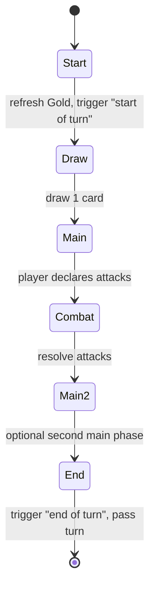

# Game rules

> Complete rules of a duel. This is the reference the rules engine implements ([technical/04-game-engine.md](../technical/04-game-engine.md)).
> Status: Draft · Last updated: 2026-10-08

All numbers below are **initial proposals** to be tuned in playtests.

## Overview

Two players (the human and the AI) each play with a deck of cards and a **Leader** (a character from the Ring). Each player starts with **30 Life**. A player loses when their Life reaches 0 or when they must draw from an empty deck.

## Match setup

1. Each player chooses a deck (30 cards) and its Leader.
2. Decks are shuffled. A coin flip decides who goes first.
3. Each player draws **4 cards**; the second player draws **5** and gets one **Rhinegold token** (catch-up resource).
4. **Mulligan:** each player may put back any number of cards once and redraw that many.

## Zones

| Zone | Visibility | Description |
|------|------------|-------------|
| Deck | Hidden | Draw pile |
| Hand | Owner only | Max 10 cards; extra draws are discarded |
| Board | Public | Up to **6 units** per player |
| Artifacts | Public | Up to 3 artifacts per player |
| Graveyard | Public | Destroyed units and used spells |
| Banished | Public | Removed from the game (cannot be resurrected) |

> **Open question:** Single board row, or two rows (front / back line) as in Gwent? Two rows add depth but cost screen space in portrait.

## Resource: Gold

- Each player has a **Gold** pool. At the start of their turn, max Gold increases by 1 (up to 10) and the pool refills.
- Cards cost Gold to play.
- *Theme hook:* some cards (Nibelungs) produce extra Gold or let you "hoard" unspent Gold.

## Turn phases

1. **Start** — max Gold +1, refill Gold, "start of turn" effects.
2. **Draw** — draw 1 card.
3. **Main** — play cards, activate the Leader ability (once per turn), in any order.
4. **Combat** — each ready unit may attack an enemy unit or the enemy Leader.
5. **End** — "end of turn" effects; turn passes.

> **Open question:** Keep a separate combat phase, or allow attacks anytime during main (Hearthstone style)? The latter is simpler on mobile.

## Units and combat

- Units have **Attack** and **Health**.
- A unit cannot attack on the turn it is played (*summoning sickness*) unless it has **Charge**.
- When a unit attacks a unit, both deal damage equal to their Attack simultaneously.
- Damage persists until the end of the turn → *Open question:* or permanently (Hearthstone)? Proposal: permanent.
- A unit at 0 Health is destroyed and goes to the graveyard.
- **Guard** units must be attacked before other targets.

## Leader

- Each Leader has Life 30 and a **Leader ability** (costs Gold, once per turn).
- Example: *Wotan — "Spear of Treaties" (2 Gold): give a unit Guard.*

## The Ring (signature mechanic)

The Ring is a special neutral legendary artifact that can enter play through specific cards.
- Its holder gains a strong bonus each turn (e.g. +2 Gold or draw a card).
- **Curse:** at the end of each of their turns, the holder loses Life equal to the number of turns they have held it.
- Certain effects can **steal** the Ring. Returning it to the Rhine (a specific card) removes it from the game.

> **Open question:** Is the Ring always present in every match (shared objective), or only via cards in the deck?

## Victory and defeat

- Enemy Leader Life ≤ 0 → victory.
- Drawing from an empty deck → take *fatigue* damage (1, then 2, 3…) — or immediate loss (to decide).
- Simultaneous zero → draw.
- Campaign chapters may add **special victory conditions** (e.g. survive 8 turns, retrieve the Rhinegold).

## Timing and effect resolution

- Effects resolve one at a time, in the order they were triggered (first in, first out).
- Triggered abilities: `On play`, `On death`, `Start of turn`, `End of turn`, `On attack`, `On damage`.
- No player responses during the opponent's turn (no "instant speed") → keeps mobile play simple.
