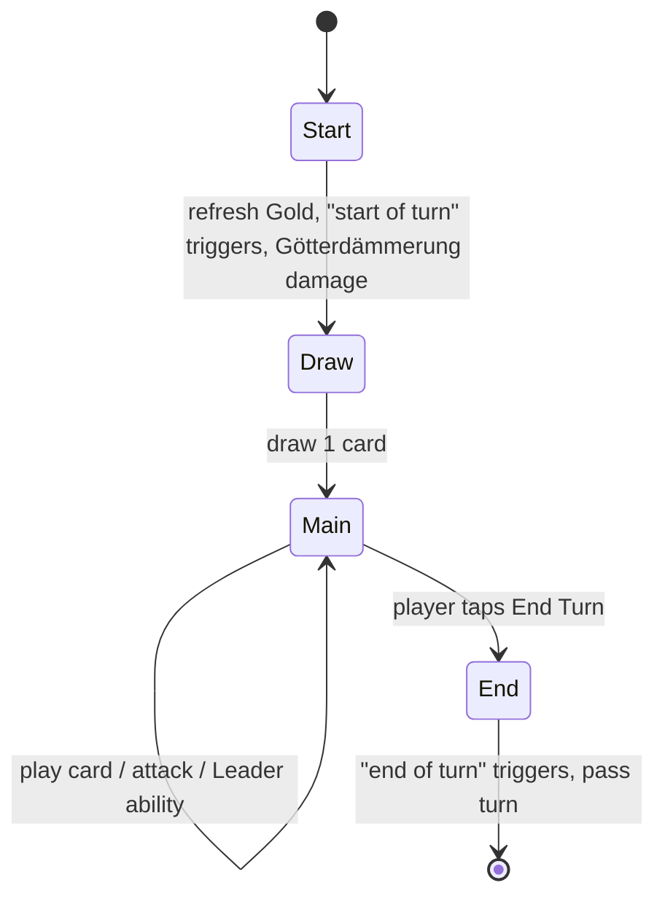

# Game rules

> Complete rules of a duel. This is the reference the rules engine implements ([technical/04-game-engine.md](../technical/04-game-engine.md)).
> Status: Draft · Last updated: 2026-10-09

All numbers below are **initial proposals** to be tuned in playtests.

## Overview

Two players (the human and the AI) each play with a deck of cards and a **Leader** (a character from the Ring). Each player starts with **20 Life**. A player loses when their Life reaches 0.

## Target match length

A match should last **5–7 minutes**, i.e. about **8–10 turns per player**. Every rule below serves that target:

| Lever | Choice | Effect on length |
|-------|--------|------------------|
| Starting Life | 20 (not 30) | Removes ~2–3 turns |
| Combat | Attacks during the Main phase, no separate phase | Fewer taps per turn |
| End-game clock | [Götterdämmerung](#götterdämmerung-turn-limit) from turn 10 | Guarantees an ending |
| AI turn | Short animations, 2× / instant option | Less waiting |

Match length is measured with AI vs AI simulations ([technical/09-testing.md](../technical/09-testing.md)).

## Match setup

1. Each player chooses a deck (30 cards) and its Leader.
2. Decks are shuffled. A coin flip decides who goes first.
3. Each player draws **4 cards**; the second player draws **5** and gets one **Rhinegold token** (catch-up resource: +1 Gold once).
4. **Mulligan:** each player may put back any number of cards once and redraw that many.

## Zones

| Zone | Visibility | Description |
|------|------------|-------------|
| Deck | Hidden | Draw pile |
| Hand | Owner only | Max 10 cards; extra draws are discarded |
| Board | Public | Up to **6 units** per player |
| Artifacts | Public | Up to 3 artifacts per player |
| Graveyard | Public | Destroyed units and used spells |
| Banished | Public | Removed from the game (cannot be resurrected) |

> **Decision (2026-10-09):** Single board row per player (no front / back line) — readability in portrait.

## Resource: Gold

- Each player has a **Gold** pool. At the start of their turn, max Gold increases by 1 (up to 10) and the pool refills.
- Cards cost Gold to play.
- *Theme hook:* some cards (Nibelungs) produce extra Gold or let you "hoard" unspent Gold.

## Turn phases

1. **Start** — max Gold +1, refill Gold, "start of turn" effects, then [Götterdämmerung](#götterdämmerung-turn-limit) damage if active.
2. **Draw** — draw 1 card (nothing happens if the deck is empty).
3. **Main** — in any order: play cards, attack with ready units, activate the Leader ability (once per turn).
4. **End** — "end of turn" effects; turn passes.

## Units and combat

- Units have **Attack** and **Health**.
- During the Main phase, each ready unit may attack **once**: an enemy unit or the enemy Leader.
- A unit cannot attack on the turn it is played (*summoning sickness*) unless it has **Charge**.
- When a unit attacks a unit, both deal damage equal to their Attack simultaneously.
- Damage is **permanent**: a damaged unit stays damaged until healed or destroyed.
- A unit at 0 Health is destroyed and goes to the graveyard.
- **Guard** units must be attacked before other targets.

## Leader

- Each Leader has Life 20 and a **Leader ability** (costs Gold, once per turn).
- Example: *Wotan — "Spear of Treaties" (2 Gold): give a unit Guard.*

## The Ring (signature mechanic)

The Ring is a special neutral legendary artifact that enters play only through specific cards.
- Its holder gains a strong bonus each turn (e.g. +2 Gold or draw a card).
- **Curse:** at the end of each of their turns, the holder loses Life equal to the number of turns they have held it, **capped at 3 per turn**.
- Certain effects can **steal** the Ring. Returning it to the Rhine (a specific card) removes it from the game.

> **Decision (2026-10-09):** The Ring is not present by default; it enters play only through specific cards in a deck.

> **Open question:** With 20 Life the curse is proportionally harsher (1+2+3+3 = 9 Life over 4 turns). Tune bonus vs curse in playtests.

## Götterdämmerung (turn limit)

The end-game clock, themed on the burning of Valhalla.

- From the start of **turn 10** of each player, Valhalla burns: at the start of their turn, that player's Leader takes **1 damage**, then 2, then 3, and so on (+1 each turn).
- It cannot be prevented, except by specific legendary cards (e.g. Brünnhilde's sacrifice).
- The UI shows a countdown from turn 7 so the player can anticipate it.
- It replaces deck-out *fatigue*: drawing from an empty deck simply draws nothing.

> **Open question:** Turn 10 or turn 8? Decide from measured match length.

## Victory and defeat

- Enemy Leader Life ≤ 0 → victory.
- Both Leaders reach 0 at the same time (e.g. Götterdämmerung, area damage) → draw.
- Campaign chapters may add **special victory conditions** (e.g. survive 8 turns, retrieve the Rhinegold).

## Timing and effect resolution

- Effects resolve one at a time, in the order they were triggered (first in, first out).
- Triggered abilities: `On play`, `On death`, `Start of turn`, `End of turn`, `On attack`, `On damage`.
- No player responses during the opponent's turn (no "instant speed") → keeps mobile play simple.
