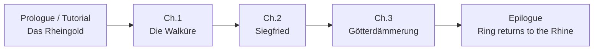

# Game modes

> Every way the player can play, and how modes connect.
> Status: Draft · Last updated: 2026-10-08

## Overview

| Mode | Purpose | Unlocked |
|------|---------|----------|
| Tutorial | Teach the rules | First launch (skippable) |
| Campaign | Story through the four operas | After tutorial |
| Quick match | Free play vs AI | After tutorial |
| Deck builder | Create / edit decks | After tutorial |

## Tutorial

- Integrated into the *Rheingold* prologue: the player plays Wotan against Alberich.
- Teaches step by step: playing a unit, Gold, attacking, Leader ability, keywords, the Ring.
- Scripted hands and AI moves (deterministic).

## Campaign

Four chapters, each with 5–8 duels following the opera's story.

- Each duel has a **fixed opponent** (character + preconstructed deck) and optionally **special rules** (e.g. "Fafner's lair: the enemy Leader starts with 50 Life").
- Story is told between duels with illustrated text panels (no voice acting in v1.0).
- Rewards: new cards, new Leaders, decks.
- The player can switch to their own deck or a chapter-provided deck.

> **Open question:** Linear chapters, or a node map with optional side duels (e.g. Mime's riddle game)?

## Quick match

- Choose your deck, choose opponent deck (or random), choose difficulty (Easy / Normal / Hard).
- Gives small rewards (see [06-progression](06-progression.md)).

## Deck builder

- Browse collection with filters (faction, cost, type, rarity, keyword, owned/not owned).
- Create, rename, duplicate, delete decks; live validation of deck rules.
- Mana-curve chart and card-type breakdown.
- Number of deck slots: 12 (proposal).

## Optional / post-launch ideas

- **Challenges**: puzzles ("win this turn").
- **Gauntlet**: chain of AI duels with escalating difficulty, roguelike-lite.
- **Daily duel**: offline seed-based daily challenge.
