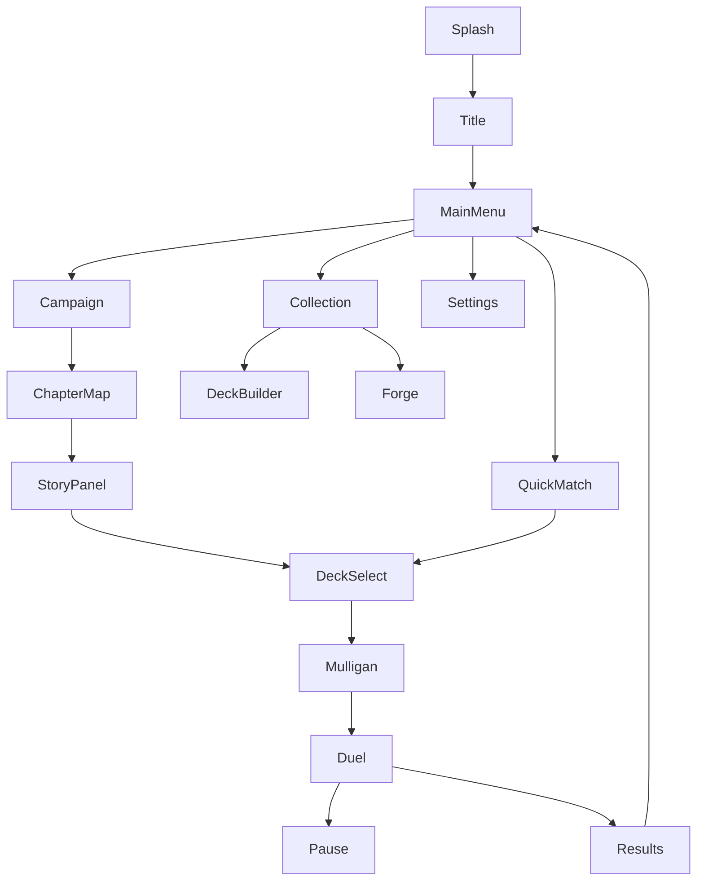

# UI / UX

> Screens, navigation and interaction design for an Android phone.
> Status: Draft · Last updated: 2026-10-08

## Platform constraints

- **Portrait** orientation, one-handed use where possible.
- Reference resolution 1080×1920; must adapt from 16:9 to 20:9+ aspect ratios and display cutouts (notches).
- Minimum touch target: 48 dp.
- Android back button must always do something sensible (go back / open pause menu).

> **Open question:** Portrait or landscape for the duel screen? Portrait fits mobile habits (Marvel Snap); landscape gives a wider board (Hearthstone).

## Screen flow



## Screens

| Screen | Key elements |
|--------|--------------|
| Main menu | Campaign, Quick match, Collection, Settings; Hoard counter |
| Chapter map | Chapter nodes, progress, rewards preview |
| Deck select | Deck list, Leader portrait, validity indicator |
| Mulligan | Opening hand, tap to mark cards, confirm |
| **Duel** | Enemy Leader + Life (top), enemy board, own board, own hand (bottom fan), Gold counter, end-turn button, Leader ability button, graveyard/deck counters |
| Results | Win/lose, rewards, continue |
| Collection / Deck builder | Card grid, filters, deck list panel, mana curve |
| Settings | Audio volumes, language, animation speed, reset progress |

## Duel screen layout (portrait draft)

```
┌──────────────────────────────┐
│ [Enemy Leader ♥30]  deck 22  │
│ ▢ ▢ ▢ ▢ ▢ ▢   enemy board    │
│ ─────────── artifacts ────── │
│ ▢ ▢ ▢ ▢ ▢ ▢   your board     │
│ [Your Leader ♥30] [Ability]  │
│ Gold ●●●●○○        [END TURN]│
│   ╭──╮╭──╮╭──╮╭──╮╭──╮       │
│   hand (fanned, scrollable)  │
└──────────────────────────────┘
```

## Gestures

| Action | Gesture |
|--------|---------|
| Inspect card | Long press → zoomed card with full text and keyword tooltips |
| Play card | Drag from hand onto board (or onto a target) |
| Attack | Drag from own unit to target; valid targets highlighted |
| Cancel | Release outside a valid target |
| Accessibility alternative | Tap card → tap target (no drag required) |

## Feedback

- Valid targets glow; invalid ones dim.
- Every rules event has an animation + sound (damage numbers, death, draw).
- AI turn is visible step by step; speed configurable (1×, 2×, instant).
- Log of the last actions accessible from the duel screen.

## Accessibility

- Text size option; colour-blind safe faction colours (don't rely on colour alone — use icons).
- No time pressure on the player's turn.
- Haptic feedback toggle.
