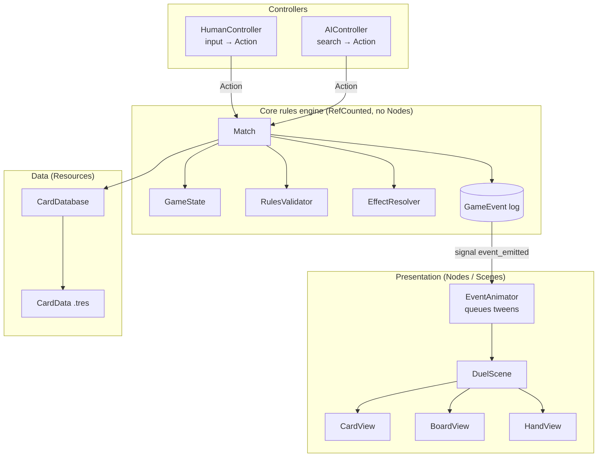

# Architecture

> High-level structure of the Godot project and the rules that keep it maintainable.
> Status: Draft · Last updated: 2026-10-09

## Stack

| Concern | Choice |
|---------|--------|
| Engine | **Godot 4.7.2** — see [ADR-0001](../adr/0001-godot-gdscript-android.md) |
| Language | GDScript, static typing mandatory ([08-coding-standards](08-coding-standards.md)) |
| Renderer | Mobile (Vulkan) with Compatibility (OpenGL ES 3) fallback for older devices |
| Target | Android, arm64-v8a (+ armeabi-v7a if needed) |
| Network | None (offline) |

> **Decision (2026-10-09):** Godot version pinned to **4.7.2** (editor, export templates and CI). Any upgrade goes through a new ADR.

## Core principle: rules engine ≠ presentation

The game logic is a **pure GDScript model** with no dependency on the scene tree (`RefCounted` classes + `Resource` data). Scenes only *display* the state and *send* player intents.

Why:
- **AI** can clone the game state and simulate moves cheaply ([05-ai-opponent](05-ai-opponent.md)).
- **Tests** run headless without instantiating scenes ([09-testing](09-testing.md)).
- **Determinism**: same seed + same actions = same game → reproducible bugs, replays.
- UI can be reworked without touching rules.

### Data flow of one player action

1. Player drags a card → `HumanController` builds an `Action` (e.g. `PlayCardAction`).
2. `Match.apply(action)` → `RulesValidator` checks legality → state is mutated → `GameEvent`s are appended.
3. `Match` emits `event_emitted(event)` for each event.
4. `EventAnimator` queues animations; views update from events (never read hidden state directly).
5. Input is locked while animations play.

## Autoloads (singletons)

Keep them few and thin.

| Autoload | Responsibility |
|----------|----------------|
| `CardDatabase` | Loads all `CardData` resources at startup, lookup by ID |
| `SaveManager` | Read/write player profile ([07-persistence](07-persistence.md)) |
| `SceneRouter` | Screen transitions, back-button handling |
| `AudioManager` | Music / SFX buses, leitmotif stingers |
| `Settings` | User settings (volumes, language, animation speed) |

The `Match` itself is **not** an autoload: it is created per duel and owned by the duel scene.

## Communication rules

- Core → Presentation: only through `GameEvent`s / signals. Core never references a Node.
- Presentation → Core: only through `Action` objects.
- Between UI nodes: signals up, method calls down ("call down, signal up").
- No global event bus for game logic (events are scoped to the `Match`); a small `UIEvents` bus is acceptable for cross-screen UI notifications if needed.

## Cross-cutting concerns

- **Localisation**: all strings via `tr()` keys; card texts keyed by card ID.
- **Logging**: a `Log` helper with levels; debug builds keep the full `GameEvent` log for bug reports.
- **Performance**: object pooling for card views; avoid per-frame `_process` in idle UI.
