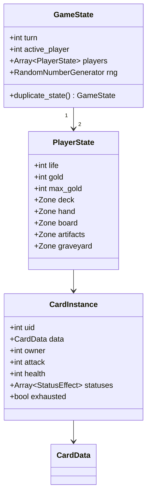

# Data model

> How cards, decks and effects are represented as data. Implements [functional/04-cards.md](../functional/04-cards.md).
> Status: Draft · Last updated: 2026-10-08

## Principles

- **Data-driven**: a new card should normally need *zero* new code — only a new `.tres` composed of existing effects.
- **Static vs runtime**: `CardData` (immutable definition, a `Resource`) is separate from `CardInstance` (runtime object in a match, `RefCounted`).
- **Stable IDs**: saves and decks reference cards by `id: StringName`, never by file path.

## Static definitions (Resources)

```gdscript
class_name CardData
extends Resource

enum Type { UNIT, SPELL, ARTIFACT }
enum Rarity { COMMON, RARE, EPIC, LEGENDARY }

@export var id: StringName
@export var faction: StringName          # &"gods", &"nibelungs", … , &"neutral"
@export var type: Type
@export var subtypes: Array[StringName]  # &"dwarf", &"weapon"…
@export var rarity: Rarity
@export var cost: int
@export var attack: int                  # units only
@export var health: int                  # units only
@export var keywords: Array[StringName]  # &"guard", &"charge"…
@export var abilities: Array[AbilityData]
@export var leitmotifs: Array[StringName]
@export var art: Texture2D
# name / rules text / flavour come from translation keys derived from `id`
```

```gdscript
class_name AbilityData
extends Resource

@export var trigger: StringName          # &"on_play", &"on_death", &"start_of_turn"…
@export var condition: ConditionData     # optional
@export var target: TargetData           # who is affected
@export var effects: Array[EffectData]   # executed in order
```

`EffectData` subclasses (one per effect kind): `DealDamageEffectData`, `DrawCardsEffectData`, `GainGoldEffectData`, `SummonEffectData`, `BuffEffectData`, `ResurrectEffectData`, `TransformEffectData`…

Other resources: `LeaderData` (life, ability), `DeckData` (leader id + list of card ids), `CampaignDuelData` (opponent deck, AI profile, special rules, rewards).

## Runtime model (RefCounted)



- `uid` is unique per match (cards with the same `CardData` are distinguishable).
- `duplicate_state()` performs a deep copy for AI simulation.

## Card authoring pipeline

> **Open question:** Author cards directly in the Godot inspector (`.tres`), or in a spreadsheet/CSV converted by a `tools/` script? A spreadsheet is better for balancing ~120 cards; `.tres` is simpler to start.

Proposed: start in the inspector, add a CSV import/export tool once the card count exceeds ~30.

## Validation

A debug-only check at startup (and in CI) verifies every `CardData`:
- unique `id`, translation keys present, art assigned,
- units have attack/health, spells have at least one ability,
- referenced effects/targets are valid.
