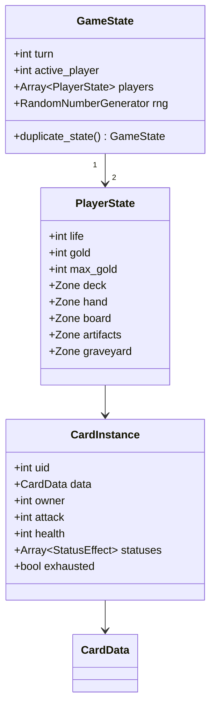

# Data model

> How cards, decks and effects are represented as data. Implements [functional/04-cards.md](../functional/04-cards.md).
> Status: Draft · Last updated: 2026-10-09

## Principles

- **Data-driven**: a new card should normally need *zero* new code — only a new row in `cards/<faction>.md` composed of existing effects.
- **Static vs runtime**: `CardData` (immutable definition, a `Resource`) is separate from `CardInstance` (runtime object in a match, `RefCounted`).
- **Stable IDs**: saves and decks reference cards by `id: StringName`, never by file path.

## Static definitions (Resources)

```gdscript
class_name CardData
extends Resource

enum Type { UNIT, SPELL, ARTIFACT }
enum Rarity { COMMON, RARE, EPIC, LEGENDARY }

@export var id: StringName
@export var faction: StringName          # &"gods", &"nibelungs", … , &"neutral"
@export var type: Type
@export var subtypes: Array[StringName]  # &"dwarf", &"weapon"…
@export var rarity: Rarity
@export var cost: int
@export var attack: int                  # units only
@export var health: int                  # units only
@export var keywords: Array[StringName]  # &"guard", &"charge"…
@export var abilities: Array[AbilityData]
@export var leitmotifs: Array[StringName]
@export var art: Texture2D
# name / rules text / flavour come from translation keys derived from `id`
```

```gdscript
class_name AbilityData
extends Resource

@export var trigger: StringName          # &"on_play", &"on_death", &"start_of_turn"…
@export var condition: ConditionData     # optional
@export var target: TargetData           # who is affected
@export var effects: Array[EffectData]   # executed in order
```

`EffectData` subclasses (one per effect kind): `DealDamageEffectData`, `DrawCardsEffectData`, `GainGoldEffectData`, `SummonEffectData`, `BuffEffectData`, `ResurrectEffectData`, `TransformEffectData`…

Other resources: `LeaderData` (life, ability), `DeckData` (leader id + list of card ids), `CampaignDuelData` (opponent deck, AI profile, special rules, rewards).

## Runtime model (RefCounted)



- `uid` is unique per match (cards with the same `CardData` are distinguishable).
- `duplicate_state()` performs a deep copy for AI simulation.

## Card authoring pipeline

> **Decision (2026-10-09):** Cards are authored as **Markdown tables** in `cards/<faction>.md` (source of truth) and converted to `.tres` by a script. See [ADR-0002](../adr/0002-cards-authored-in-markdown.md).

Why Markdown: readable on GitHub and in VS Code, easy to diff and review, the whole card set of a faction fits on one page for balancing.

### Source format

One file per faction (`cards/gods.md`, `cards/nibelungs.md`, `cards/walsungs.md`, `cards/valkyries.md`, `cards/neutral.md`), one table row per card:

```markdown
| id | name | type | subtypes | rarity | cost | atk | hp | keywords | abilities | leitmotifs | flavour |
|----|------|------|----------|--------|------|-----|----|----------|-----------|------------|---------|
| alberich_lord | Alberich, Lord of the Nibelungs | unit | dwarf | legendary | 4 | 3 | 4 | | on_play: gain_gold(2); on_play[holds_ring]: draw(1) | gold, ring | *(libretto quote)* |
| loge_fire | Loge's Fire | spell | | rare | 3 | | | | on_play: damage(all_enemy_units, 2) | fire | |
```

- `faction` comes from the file name.
- `name` and `flavour` are the **English** source text; the converter writes them into the `en` column of the localisation file. German, Spanish and French are translated there.
- `abilities` uses a small syntax: `trigger[condition]: effect(args); …`. Every trigger, condition, effect and keyword must exist in the engine; unknown names are errors.
- Rules text shown on the card is **generated from `keywords` + `abilities`**, so it can never disagree with the actual behaviour.

### Converter

- Written in GDScript (one language for the whole project), run with headless Godot from the command line and from CI; exact command documented in the tool's header once written.
- Parses every `cards/*.md`, validates (see below), writes `game/data/cards/<faction>/<id>.tres` and updates the English localisation entries.
- Generated `.tres` files are committed (the Godot project opens without running the tool) but **never edited by hand**.
- CI re-runs the converter and fails if it produces a diff (source and generated files out of sync).

## Validation

The converter, plus a debug-only check at startup and in CI, verifies every card:
- unique `id`, translation keys present, art assigned,
- units have attack/health, spells have at least one ability,
- referenced effects/targets are valid.
