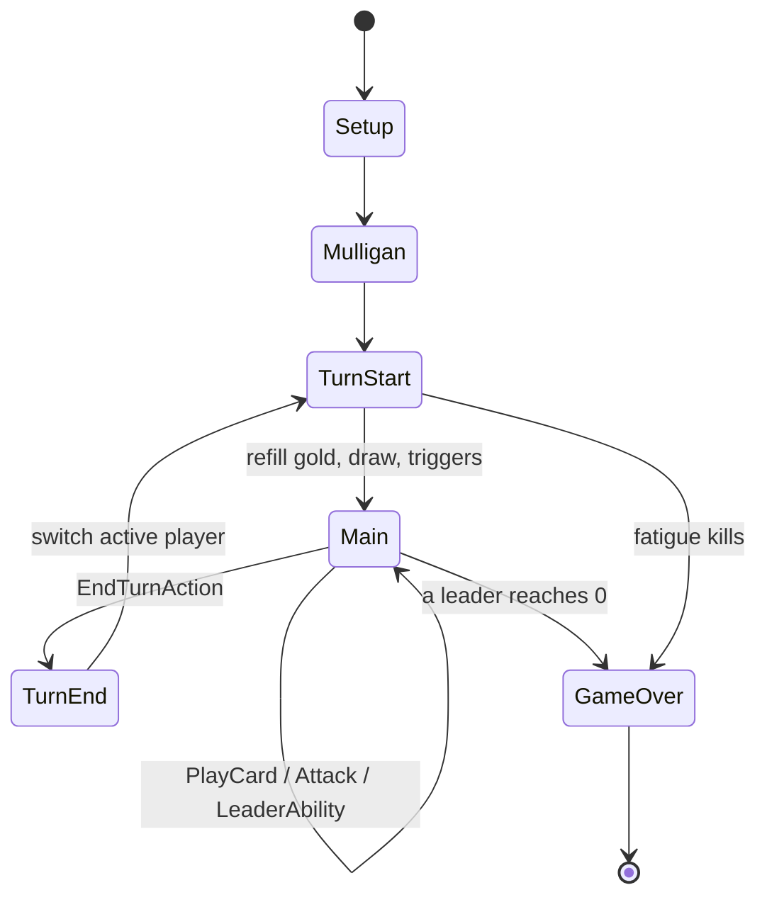

# Game engine

> The rules engine: state, turn flow, actions, effect resolution. Implements [functional/03-game-rules.md](../functional/03-game-rules.md).
> Status: Draft · Last updated: 2026-10-08

## Responsibilities

- Hold the complete `GameState` ([03-data-model](03-data-model.md#runtime-model-refcounted)).
- Validate and apply player `Action`s.
- Run the turn state machine.
- Resolve triggered abilities and effects in a deterministic order.
- Emit `GameEvent`s for the presentation layer and the log.

No Node, no `await`, no timers inside `core/` — everything is synchronous and deterministic.

## Match API (draft)

```gdscript
class_name Match
extends RefCounted

signal event_emitted(event: GameEvent)
signal match_ended(winner: int)

func _init(deck_a: DeckData, deck_b: DeckData, seed: int) -> void
func get_state() -> GameState                 # read-only usage by views
func get_legal_actions(player: int) -> Array[Action]
func is_legal(action: Action) -> bool
func apply(action: Action) -> void            # validates, mutates, emits events
```

## Turn state machine

[Turn phases](../functional/03-game-rules.md#turn-phases) are modelled as an enum + transition function.



## Actions (command pattern)

| Action | Payload |
|--------|---------|
| `MulliganAction` | card uids to replace |
| `PlayCardAction` | card uid, optional board slot, optional target |
| `AttackAction` | attacker uid, target uid (unit or leader) |
| `UseLeaderAbilityAction` | optional target |
| `EndTurnAction` | – |
| `ConcedeAction` | – |

Each action is a small serialisable object → enables replays, bug reports, and AI search.

## Effect resolution

1. An action or event produces **triggers** (e.g. `on_play`, `on_death`).
2. Triggers are pushed onto a **FIFO resolution queue** in a deterministic order: active player first, then board position left→right.
3. The resolver pops one, checks its condition, resolves targets, runs its effects.
4. Effects may emit events that create new triggers → appended to the queue.
5. After each step, **state-based checks**: destroy units at ≤ 0 health, check victory.
6. A safety limit (e.g. 500 resolutions per action) prevents infinite loops.

## Randomness

- One `RandomNumberGenerator` stored in `GameState`, seeded at match creation.
- All randomness (shuffle, random targets) goes through it — never `randi()` globally.
- AI simulations use a copy so they don't consume the real RNG.

## Events

`GameEvent` subclasses: `CardDrawn`, `CardPlayed`, `UnitSummoned`, `DamageDealt`, `UnitDestroyed`, `GoldChanged`, `TurnStarted`, `TurnEnded`, `RingCursed`, `MatchEnded`…

Events carry only what the receiving player is allowed to see (hidden information filter applied before emission to the human player's view).
