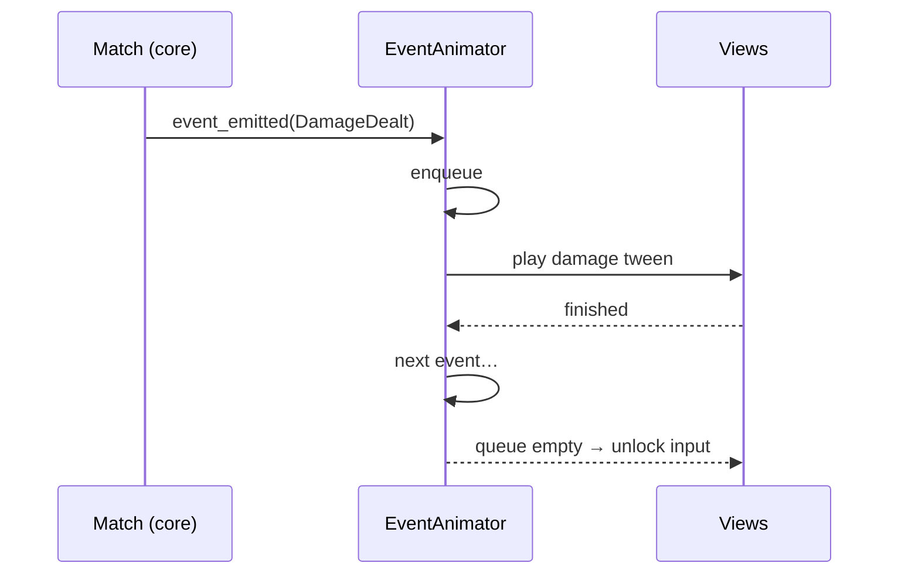

# UI implementation

> How screens and interactions from [functional/07-ui-ux.md](../functional/07-ui-ux.md) are built in Godot.
> Status: Draft · Last updated: 2026-10-08

## Display settings (`project.godot`)

| Setting | Value |
|---------|-------|
| `display/window/size/viewport_width × height` | 1080 × 1920 |
| `display/window/handheld/orientation` | Portrait |
| `display/window/stretch/mode` | `canvas_items` |
| `display/window/stretch/aspect` | `expand` (layouts use anchors/containers to absorb extra height) |
| Safe area | Read `DisplayServer.get_display_safe_area()` and pad the root UI for notches |

## Scene composition

- One scene per screen under `scenes/screens/`, swapped by the `SceneRouter` autoload (with a fade transition).
- Reusable components under `scenes/components/`: `CardView`, `HandView`, `BoardView`, `LeaderView`, `GoldBar`, `CardZoomPopup`.
- UI built with `Control` nodes and containers; a shared `Theme` resource in `ui/theme/` for fonts, colours, styleboxes.

## CardView

- Displays a `CardInstance` (runtime stats) or a `CardData` (collection).
- Updates only from events/bindings; never mutates game state.
- States: in hand, on board, zoomed, dragging, targetable, exhausted.
- Pooled to avoid re-instancing during a match.

## Input

- Touch handled via `_gui_input` on `CardView` / board slots, using `InputEventScreenTouch` and `InputEventScreenDrag` (with *emulate touch from mouse* enabled for desktop testing).
- Drag-and-drop: custom implementation (more control than `_get_drag_data`) that draws a targeting arrow and highlights legal targets from `Match.get_legal_actions()`.
- Tap-tap alternative mode for accessibility.
- Long press (≥ 400 ms) → `CardZoomPopup`.
- Android back button: `NOTIFICATION_WM_GO_BACK_REQUEST` handled by `SceneRouter`.

## Animation pipeline

- `EventAnimator` serialises `GameEvent`s into `Tween`s; game logic is already resolved, animations only catch up.
- Animation speed multiplier from `Settings` (1×, 2×, instant).

## Localisation

- `localization/strings.csv` (keys + `en`, `fr` columns), imported as Godot translations.
- All visible text via `tr("KEY")`; card texts via keys built from the card ID.
- Rules text with numbers uses `tr(...).format({...})`.
- Test long-text languages (French) for card text overflow; card text uses auto-shrinking `Label`/`RichTextLabel`.

## Performance targets

- 60 fps during animations on the reference device.
- Texture atlases / compressed textures (ETC2/ASTC) for card art; art loaded at the size it is displayed.
