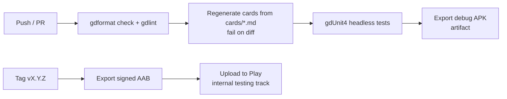

# Build & release

> Producing Android builds, signing, publishing on Google Play, and CI.
> Status: Draft · Last updated: 2026-10-09

## Local setup

| Tool | Notes |
|------|-------|
| Godot 4.7.2 | Editor + matching **export templates** |
| JDK 17 | Required by the Android build tools |
| Android SDK | Platform-tools, build-tools, platform matching Godot's target API; set path in *Editor Settings → Export → Android* |
| Debug keystore | Generated once per machine (`keytool`) for debug builds |

Follow the official guide: *Exporting for Android* in the Godot docs for the pinned version.

## Export presets

| Preset | Output | Use |
|--------|--------|-----|
| `Android Debug` | `.apk` | Install on device for testing (one-click deploy from the editor) |
| `Android Release` | `.aab` (Gradle build) | Google Play upload |

- Architectures: `arm64-v8a` (required); `armeabi-v7a` optional for old devices.
- Permissions: none beyond defaults (no Internet needed — disable `INTERNET` in release if possible).
- Target SDK: as required by Google Play at release time.

## Signing & secrets

- The **release keystore is never committed**. `export_presets.cfg` must not contain passwords.
- Locally: use `.godot/export_credentials.cfg` (Godot 4 stores credentials there, ignored by git) or environment variables.
- In CI: keystore as base64 secret, passwords as secrets; Godot reads `GODOT_ANDROID_KEYSTORE_RELEASE_PATH`, `GODOT_ANDROID_KEYSTORE_RELEASE_USER`, `GODOT_ANDROID_KEYSTORE_RELEASE_PASSWORD`.
- Use **Play App Signing** (Google holds the app signing key; we keep the upload key) — losing the upload key is recoverable.

## Versioning

- `version/name`: semantic version `MAJOR.MINOR.PATCH` (e.g. `0.3.0`).
- `version/code`: integer, strictly increasing at every Play upload (e.g. derived from CI build number).
- Git tag `vX.Y.Z` per release; changelog in `CHANGELOG.md`.

## CI (GitHub Actions — proposal)

- Use a Docker image or action that provides headless Godot **4.7.2** + matching export templates.
- Cache the `.godot/imported` folder to speed up imports.

## Release tracks

Internal testing → Closed testing (friends/playtesters) → Open testing → Production.

## Store requirements checklist

- [ ] App icon (adaptive), feature graphic, screenshots (phone)
- [ ] Short / full description and screenshots (EN, DE, ES, FR)
- [ ] Privacy policy URL (even with no data collection)
- [ ] Data safety form (no data collected)
- [ ] Content rating questionnaire (target PEGI 12)
- [ ] Asset licences verified ([functional/08-art-and-audio.md](../functional/08-art-and-audio.md#asset-rights-checklist))
