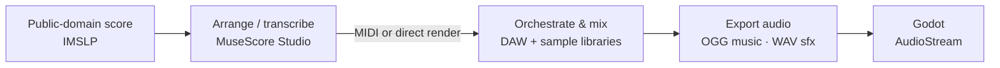

# Audio tools

> Recommended software and workflow for music (Wagner leitmotifs) and sound effects. Direction and rights: [functional/08-art-and-audio.md](../functional/08-art-and-audio.md).
> Status: Draft · Last updated: 2026-10-09

Prices and licences change — check them before buying.

## Key principle: MIDI is a working format, not a shipped format

Godot does not play MIDI files natively. The workflow is:

The game ships **rendered audio** (OGG / WAV). MIDI files stay in the source folder.

## Music

### Sources

| Source | Use | Rights |
|--------|-----|--------|
| **IMSLP** (imslp.org) | Full scores and vocal scores of the four operas | Wagner's scores are public domain; check each scan's edition notes |
| MIDI files found online | Avoid, or verify the licence | A third-party sequencing can carry its own rights |
| Commercial recordings | **Not usable** | Performers' / producers' rights |

### Recommended tools

| Need | Recommended | Alternatives | Notes |
|------|-------------|--------------|-------|
| **Write / arrange the leitmotifs** | **MuseScore Studio** (free) | Dorico SE (free, limited), Sibelius | Enter notes from the score, play back, export MIDI. With **Muse Sounds** (free orchestral library via Muse Hub) it renders a convincing orchestra directly |
| **DAW (orchestration, mix, export)** | **Reaper** | LMMS (free), Ardour (open source), FL Studio, Cubase | Reaper: cheap licence, long evaluation period, lightweight |
| **Orchestral samples** | **Spitfire LABS** (free), **BBC Symphony Orchestra Discover** (free) | Sonatina Symphonic Orchestra (free SFZ), paid libraries later | Wagner needs brass (horns, Wagner tubas) and strings — test brass quality first |

Typical work for one leitmotif stinger (2–8 s): find the motif in the score → enter it in MuseScore → render with Muse Sounds or export MIDI to Reaper with orchestral samples → mix → export OGG.

### Leitmotifs to produce first (from [08-art-and-audio](../functional/08-art-and-audio.md#music))

Rhinegold · Ring · Valhalla · Curse · Sword (Nothung) · Ride of the Valkyries · Magic Fire · Twilight (Götterdämmerung).

## Sound effects

| Need | Recommended | Notes |
|------|-------------|-------|
| **Edit / cut / normalise** | **Audacity** (free) | Trim, fade, loudness, export WAV/OGG |
| **Free libraries** | **Freesound.org**, **Sonniss GDC Game Audio Bundle**, **Kenney** (UI sounds) | Freesound: check each file's licence (prefer CC0; CC-BY requires credit). Sonniss: royalty-free, commercial use allowed. Kenney: CC0 |
| Record your own | Audacity + any decent USB mic or phone | Card shuffles, paper, metal (anvil for Nibelungs) — cheap and unique |

Avoid retro generators (sfxr / jsfxr): their 8-bit sound doesn't fit the tone.

## AI music / sound generators

Possible for prototyping. For the final game, check the tool's commercial terms and the copyright status of the output — this area is under active legal dispute. For Wagner-based music, arranging the public-domain score is safer and closer to the source.

## Export specs for Godot

| Asset | Format | Notes |
|-------|--------|-------|
| Background music loops | OGG Vorbis, 44.1 kHz, stereo | Enable *loop* on import; set the loop point |
| Leitmotif stingers | OGG Vorbis | Short, no loop |
| SFX | WAV 16-bit (short), OGG (long) | WAV = lowest latency |
| Loudness | Music ~ −16 LUFS, SFX balanced against music | Keep consistent across files |

- Godot audio buses: `Master` → `Music`, `SFX`, `Stingers` (volumes from Settings).
- For layered / adaptive music (e.g. add the Curse motif over the board music while the Ring is held), look at Godot's `AudioStreamInteractive` / `AudioStreamSynchronized` (Godot 4.3+).
- Keep a `CREDITS.md` entry for every third-party sound (source URL + licence).
